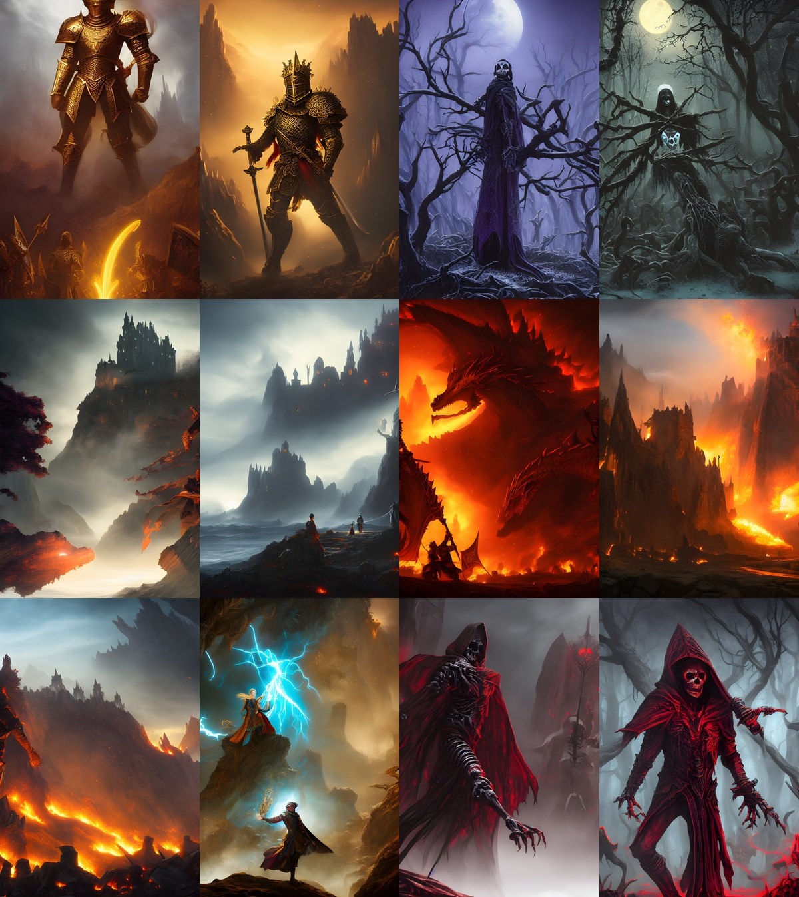

# Agentic 多模态 AIGC 游戏素材生产与评估系统

> 把「训练出一个会画 MTG 风格的模型」推进为「能够理解需求、发现低质量结果、自动补救并稳定交付的生成系统」。

本项目是递进式的两个阶段，本仓库是阶段二：

- **阶段一 `gen_project`**：解决基础模型对目标画风掌握不足的问题，完成数据构建、LoRA 微调与受控对照验证；
- **阶段二 `asset_pipeline`（本仓库）**：解决生成需求不明确、结果随机波动、后处理副作用和长批次易中断的问题，完成生产化编排与验收。

## 1. 定位

给定自然语言需求，自动生成风格一致、语义匹配、且带可追溯质量记录的游戏卡牌素材。四个具体痛点与对策：

| 痛点 | 对策 |
|---|---|
| 自然语言需求只有「画一个喷火巨龙」，扩散模型还需要主体属性、构图、光照、配色、材质 | DeepSeek Function Calling 解析为受 Schema 约束的结构化 Prompt |
| 扩散采样从随机 latent 开始，同一 Prompt 换 seed 就换构图和局部细节，质量会波动 | open_clip ViT-B-32 计算 CLIP-Score 质量门，低分自动换 seed 有限重试 |
| 原始输出边缘发软、局部纹理不足，展示素材需要更高分辨率 | 接入预训练 Real-ESRGAN 超分，并对最终图**再次评分** |
| 几百张的长批次遇到服务重启或单样本失败，只存最终图就无法解释和恢复 | `state.json` 断点续跑 + `manifest.json` 记录 Prompt/seed/尝试次数/分数/耗时 |

## 2. 端到端架构

```text
公开 MTG 图文数据
      ↓  尺寸过滤 / 坏图过滤 / dHash 去重 / 统一裁剪
数据清洗与 Caption 配对（2935 组）
      ↓  rank-16 LoRA 微调 U-Net Attention
SD1.5 + LoRA 风格适配 ──→ CLIP-Score / FID 基座对照
      ↓
自然语言需求 ──→ DeepSeek Agent 结构化 Prompt（场景级规划，批次内复用 seed 变化）
      ↓
ComfyUI / Stable Diffusion 批量生成（txt2img / img2img / IP-Adapter，挂 MTG LoRA）
      ↓
CLIP 质量门 ──→ 低分样本换 seed 有限重试（最多 3 次）
      ↓
Real-ESRGAN 超分 ──→ 最终复评（保留超分前后两版）
      ↓
manifest.json + state.json ──→ 可追溯、可恢复交付
```

系统默认**单个 ComfyUI 服务**即可运行；多 worker 只是可选的吞吐扩展，不是项目成立的前提。

## 3. 关键工程设计

**Agent 场景级规划，而非逐图调用。** DeepSeek 对每个场景调用一次，把业务语言转成视觉语言；再由本地代码把总量扩展到目标张数，靠不同 seed 产生变化。既保留需求理解能力，又避免几百次重复 API 调用带来的费用、延迟和不可复现性。返回值经过字段校验、默认值补齐和失败重试后才进入 ComfyUI，防止自由文本格式变化直接打断执行链路。

**工作流与模型解耦。** 编排器只负责结构化任务、参数填充、调度和状态管理；ComfyUI 负责实际推理；生成与后处理拓扑放在四个 JSON 工作流里。换 checkpoint、LoRA、IP-Adapter 或后处理模型时，不用改 Python 代码。启动正式任务前，先用 `validate_wf.py` 对照 ComfyUI `/object_info` 校验节点是否注册——节点名存在不等于模型一定可加载，所以验收必须落到端到端出图。

**质量闭环但不自欺。** 低于阈值的图换 seed 重采样，不改变业务需求和模型，是成本最低的失败修复方式；同时限制最大重试次数，避免为极少数困难样本造成无限算力消耗和尾部延迟。需要注意：**用 CLIP 选图后再报告 CLIP，分数上升包含选择效应**，因此该机制只能证明"按既定语义规则减少低分交付"，不能等价为人类审美提升。同理，Real-ESRGAN 补出的细节可能是假纹理，所以超分前后两版都保留并各自评分，不把超分默认包装成全面提升。

**可恢复交付。** 每完成一项就更新 `state.json`，失败项不写入已完成集合；用同一 `batch_id` 重启时只处理未完成或失败项，失败不会污染完成集合。`manifest.json` 记录需求、详细 Prompt、seed、每次尝试的分数、阶段评分、耗时和输出路径，支持单张结果回放与问题定位。

## 4. 实测结果

### 4.1 阶段一：LoRA 是否有效（单变量对照）

固定 Prompt、生成数量和评测流程，只改变是否加载 LoRA：

| 项目 | 结果 |
|---|---:|
| 原始图像 / 清洗后有效图像 | 3,000 / 2,935 |
| 训练集 / 评估集 | 2,348 / 587 |
| 受控生成样本 | 6 个 Prompt × 16 = 96 张 |
| SD1.5 基座 CLIP-Score | 0.33772 |
| LoRA CLIP-Score | 0.34609（**+2.5%**） |
| SD1.5 基座 FID | 235.92 |
| LoRA FID | 219.49（**−7.0%**） |

LoRA 同时改善了文图对齐和与真实卡图的特征分布距离，证明风格微调有效。96 张属于模型研发阶段的小规模对照，不等同于论文常用的 FID-50K。

### 4.2 阶段二：600 张正式生产验收

6 类需求 × 100 张，完整经过 Agent 改写、质量门、换 seed 重试、超分与最终复评，单 worker 完成：

| 指标 | 结果 |
|---|---:|
| 交付 | 600 / 600，成功率 100%（95% CI 99.4%–100%） |
| 实际生成次数 / 额外尝试 | 664 / 64 |
| 首次通过率（未过质量门） | 91.3%（95% CI 88.8%–93.3%） |
| 质量门选中通过率 | 99.67% |
| **最终通过率（复评后）** | **99.5%**（95% CI 98.5%–99.8%） |
| 首次原始分均值 | 0.3488 |
| 质量门选中分均值 | 0.3542（95% CI 0.3519–0.3563） |
| 超分复评后最终分均值 | 0.3590（95% CI 0.3569–0.3611） |
| 质量门带来的分数提升 | +0.0054 |
| 超分前后分数变化 | +0.0049 |
| 平均重试次数 | 0.107 |
| 端到端延迟 均值 / P50 / P95 | 13.73s / 12.46s / 22.63s |
| 吞吐 | 262 张/小时（总墙钟 2.29 小时） |
| FID（质量门原图 → 超分后最终图） | 172.25 → **183.07**（上升） |

两点必须说清楚：

- **超分让 FID 变差**（172.25 → 183.07）。系统因此保留超分前后的两版图片并分别评分，不把超分包装成全面提升；展示场景可以偏向清晰度，强调分布真实性时可以回退原图。
- 首次通过率 91.3% → 最终 99.5% 的提升，来自"质量门换 seed + 复评"的组合，**不能单独归因于某个模块**。

### 4.3 分场景结果

| 场景 | 首次通过率 | 额外尝试 | 最终分均值 |
|---|---:|---:|---:|
| 金甲骑士 | 100% | 0 | 0.3724 |
| 暮色悬崖古堡 | 93% | 7 | 0.3538 |
| 巨龙喷火 | 100% | 0 | 0.3663 |
| 精灵法师施法 | **76%** | **33** | 0.3412 |
| 神秘发光森林 | 81% | 22 | 0.3381 |
| 亡灵法师 | 98% | 2 | 0.3825 |

**精灵法师施法是全批最难的场景**：首次通过率 76%，靠 33 次额外采样才拉到 99% 最终通过率。这正是质量门存在的意义——难度在场景间分布不均，固定成本的重试把最差场景兜住。

## 5. 示例产出

600 张批次中的代表性成品（原图 2048×3072，仓库内为展示用降采样版本）：



| 文件 | 场景 | seed 尝试 | 首次分数 | 复评分数 |
|------|------|:--:|:--:|:--:|
| `txt2img_0_50.jpg` | 金甲骑士 | 1 | 0.3817 | 0.3784 |
| `txt2img_0_94.jpg` | 金甲骑士 | 1 | 0.3306 | 0.3381 |
| `txt2img_1_49.jpg` | 暮色悬崖古堡 | **2** | 0.3458 | 0.3598 |
| `txt2img_1_72.jpg` | 暮色悬崖古堡 | 1 | 0.3282 | 0.3295 |
| `txt2img_2_16.jpg` | 巨龙喷火 | 1 | 0.3490 | 0.3629 |
| `txt2img_6_18.jpg` | 巨龙喷火 | 1 | 0.3379 | 0.3505 |
| `txt2img_6_3.jpg` | 巨龙喷火 | 1 | 0.3433 | 0.3351 |
| `txt2img_7_75.jpg` | 精灵法师施法 | 1 | 0.3294 | 0.3279 |
| `txt2img_9_4.jpg` | 亡灵法师 | 1 | 0.4049 | 0.3965 |
| `txt2img_9_9.jpg` | 亡灵法师 | 1 | 0.4294 | 0.4306 |
| `txt2img_11_4.jpg` | 亡灵法师 | 1 | 0.3656 | 0.3640 |
| `txt2img_11_18.jpg` | 亡灵法师 | 1 | 0.3887 | 0.3919 |

`txt2img_1_49` 是质量门实际生效的样本：首次采样（seed 1727456117）得 0.2690，低于阈值 0.30 触发换 seed 重采样，第二次（seed 1727456118）得 0.3458 才进入后处理链路。整批 600 张中有 52 张发生过重试。

完整元数据（seed、尝试次数、各阶段耗时）见 `samples/index.json`。

## 6. 快速开始

**前置检查** —— 校验 ComfyUI API、checkpoint、工作流节点及端到端出图能力：

```bash
bash scripts/test_wf.sh
```

**小批量端到端验证**：

```bash
bash scripts/run_e2e.sh "做 3 张 MTG 风格的中国风武将卡牌图"
```

**正式生产验收**（600 张，可断点续跑）：

```bash
nohup bash scripts/run_production_benchmark.sh > production_600.log 2>&1 &
tail -f production_600.log
```

结果位于 `deliverables/production_600_*/`，核心文件为 `summary.json`、`manifest.json`、`state.json` 和最终图片。中断后续跑只需带上同一批次 ID。

## 7. ComfyUI 部署

编排器 `agent_pipeline.py` 只通过 HTTP API 与 ComfyUI 通信，不碰图形界面。默认端口 8188。

**一键安装**（前置：仓库已放到服务器，且当前 conda 环境已装 torch）：

```bash
# 确认终端提示符已经在目标 conda 环境里
bash scripts/setup_comfyui.sh
```

脚本做五件事：clone ComfyUI（GitHub 不通走 gh-proxy 镜像）→ 建独立 venv 并 `--system-site-packages` 复用系统 torch（**不污染训练环境**）→ 装自定义节点（IPAdapter-Plus、Impact-Pack、Manager）→ 下载模型（SD1.5 checkpoint、IPAdapter、CLIP-ViT-H、RealESRGAN_x4plus，走 hf-mirror）→ 调用 `convert_lora.py` 把训练侧的 diffusers/peft 格式 LoRA 转成 ComfyUI 认的 bfla 单文件。

> 下载失败不中断（IPAdapter / CLIP-ViT-H 属加分项可跳过），但 **SD1.5 checkpoint 必须下成功**，否则所有工作流都跑不了。

**启动**：

```bash
nohup <venv>/bin/python <comfyui>/main.py --listen 0.0.0.0 --port 8188 > comfy.log 2>&1 &
curl http://127.0.0.1:8188/system_stats   # 探测就绪
```

**关键配置**（`config.yaml`）：`comfyui.input_dir` 为必填项（img2img / IP-Adapter / 后处理需要，是 ComfyUI 侧的 `input` 绝对路径）；`quality.threshold` 默认 0.30，低于则换 seed 重试。

**踩过的坑**：

1. **LoRA 必须转格式**——训练产出是 diffusers/peft 格式（目录 + `adapter_model.safetensors`），ComfyUI 只认 bfla 单文件。`convert_lora.py` 会把 key `base_model.model.unet.*` 改成 `lora_unet_*`、`.lora_A/.lora_B.weight` 改成 `.lora_down/.lora_up.weight`，并打印 down/up 数量供校验。
2. **节点类名必须匹配**——手写工作流容易用错类名，`validate_wf.py` 会调 `/object_info` 逐个校验，缺哪个报哪个。
3. **双环境隔离**——ComfyUI 用独立 venv，不要在训练环境里装 ComfyUI 依赖，否则会冲掉已训好的 gen_project 依赖。
4. **新版 Impact-Pack 去掉了 RemBG 节点**——所以当前 `wf_post` 只做 Real-ESRGAN 超分，自动去背景尚未接回主链路。
5. **IP-Adapter 效果差或下不到权重就直接砍**——删掉 `wf_ipadapter` 调用即可，主链路（txt2img + Agent + 质量门 + 后处理）不受影响。

## 8. 代码结构

```text
agent_pipeline.py                   Agent 调用、任务编排、ComfyUI 调度与质量门/交付
production_benchmark_96.py          生产批次、重试、统计与断点续跑（实际入口）
production_benchmark.py             兼容入口，转发到 production_benchmark_96.py
benchmark_96.py                     阶段一/二桥接基准，不经 Agent 与质量门
scaling_summary.py                  单 worker 与 4 worker 的伸缩性实验汇总
agent_test.py                       逻辑层单测（Agent 输出校验、质量判断、断点重试）
config.yaml                         Agent、生成、评分和后处理配置
validate_wf.py                      对照 ComfyUI /object_info 校验工作流节点
convert_lora.py                     训练侧 LoRA 到 ComfyUI 格式适配
comfyui/workflows/                  四条 ComfyUI API 工作流
scripts/setup_comfyui.sh            一键安装 ComfyUI + 节点 + 模型 + LoRA 转换
scripts/test_wf.sh                  节点校验 + 四工作流真实出图冒烟
scripts/run_e2e.sh                  小批量端到端运行入口
scripts/run_production_benchmark.sh 正式生产验收入口
samples/                            600 张批次的代表性成品与元数据
```

## 9. 能力边界与诚实表述

- 600 张正式批次以 txt2img 为主；img2img、IP-Adapter 和后处理链路完成了冒烟验证，未进入正式批次；
- 当前 `wf_post` 只负责 Real-ESRGAN 超分，未正式启用自动去背景；
- CLIP-Score 是语义一致性指标，不等价于人工审美或商业可用性；它既作质量门又作报告指标，存在选择偏差，因此同时报告 FID、成功率、重试成本和样例网格。更完整的产品验证应加入独立美学模型或匿名盲评；
- Real-ESRGAN 使用公开预训练权重，本项目只做集成与验收，没有训练超分网络；
- 阶段一的 LoRA 受控实验与阶段二的生产验收是两个递进阶段，阶段差值不能归因于单一模块，也不能当作同协议连续消融；
- 600 张是内部生产验收，不等同于论文常见的 FID-50K，也不足以单独证明工业级 SLA。真正工业化还需要持续流量、并发压测、成本监控、安全审核、灰度发布和长期漂移监控；
- 多 worker 是可选吞吐扩展，本次 600 张验收在单 worker 上完成，多卡并行不属于本项目结论。
